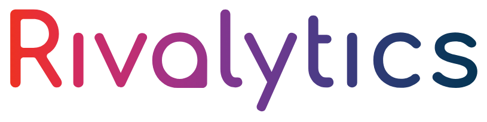
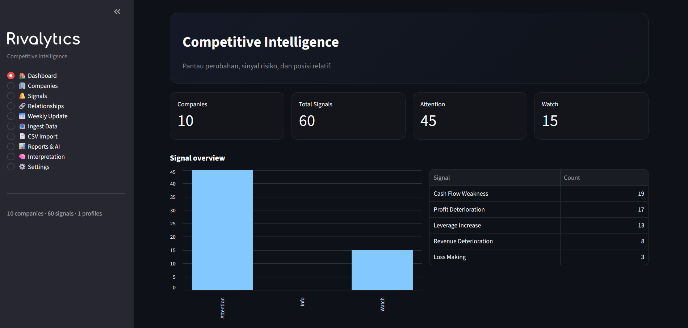
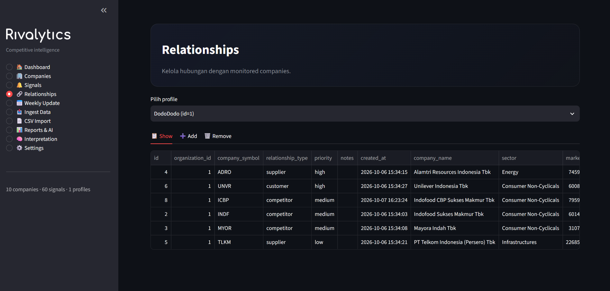
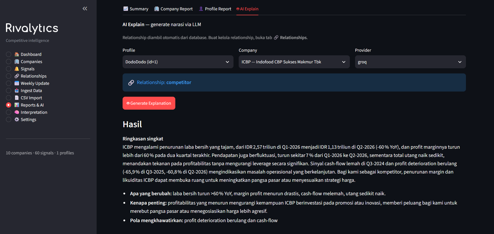
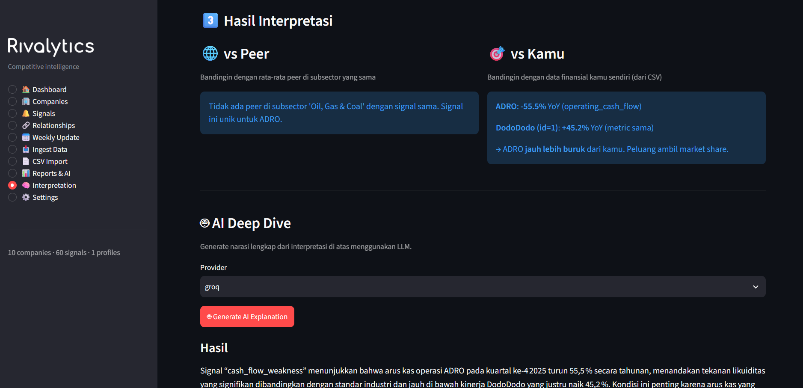

<div align="center">



**External Company Intelligence & Early-Warning Platform**

Pantau kompetitor, supplier, dan partner bisnis Anda dari data publik.
Dapatkan peringatan dini sebelum masalah jadi krisis.

[](https://python.org)
[](https://streamlit.io)
[](https://sectors.app)

[Demo Video](https://youtube.com/...) · [Teaser](https://youtube.com/...) · [Report Bug](../../issues)

</div>

## Problem

Perusahaan menengah sering kali tidak punya tim analyst untuk memantau
kondisi finansial kompetitor, supplier, atau customer mereka. Ketika
salah satu partner mengalami tekanan finansial, informasi itu baru
diketahui setelah terlambat, setelah pengiriman tertunda atau order
menurun.

## Solution

**Rivalytics** memantau data publik perusahaan yang relevan dengan
bisnis Anda, mendeteksi perubahan signifikan, dan menjelaskan
konteksnya berdasarkan relationship (competitor / supplier / customer).



## Key Features

- **Relationship-aware monitoring** — competitor, supplier, customer
  diperlakukan berbeda. Sinyal yang sama punya arti berbeda.
- **Rule-based signal detection** — revenue deterioration, profit
  drop, leverage spike, cash flow weakness, loss making.
- **AI explanation** — narasi 3-4 kalimat dalam bahasa Indonesia
  yang bisa langsung dibaca VP Operations.
- **Contextual interpretation** — dibandingkan dengan peer di
  sector yang sama *dan* dengan data perusahaan user sendiri.
- **Weekly intelligence workflow** — cek update, review, ingest.
  Cost-efficient by design.

## Quick Start

### Prerequisites

- Python 3.11+
- Sectors API key ([get one here](https://sectors.app/api))
- Groq API key ([free tier](https://console.groq.com/keys))

### Installation

```bash
git clone https://github.com/username/rivalytics.git
cd rivalytics

python -m venv .venv
.venv\Scripts\activate     # Windows
# source .venv/bin/activate  # macOS/Linux

pip install -r requirements.txt
```

### Setup API Keys

Ada dua cara konfigurasi API key:

**Cara 1 — Via file `.env`:**

```bash
cp .env.example .env
```

Edit `.env` dan isi:

```env
SECTORS_API_KEY=your_sectors_api_key_here
GROQ_API_KEY=your_groq_api_key_here
```

**Cara 2 — Via UI:**

Jalankan aplikasi, buka tab **Settings**, dan isi key langsung dari browser. Key akan tersimpan di `.env` secara otomatis.

### Run

```bash
streamlit run src/UI/app.py
```

Aplikasi akan terbuka otomatis di <http://localhost:8501>.

### First-Time Workflow

Setelah aplikasi jalan:

1. **Ingest data** — buka tab **Ingest Data**, masukkan symbol perusahaan (contoh: `ICBP`, `ADRO`, `TLKM`), klik **Ingest**.
2. **Buat profile perusahaan Anda** — buka **Companies → Profile Perusahaan**, isi nama, sector, dan size tier.
3. **Tambah relationship** — buka **Relationships**, tambahkan competitor/supplier/customer yang mau dipantau.
4. **Upload CSV (opsional)** — kalau ada data finansial internal, upload di **CSV Import** untuk interpretasi yang lebih tajam.
5. **Lihat hasil** — buka **Reports & AI** atau **Interpretation**.

### CSV Format & Requirements

User bisa upload data finansial internal via CSV (opsional) untuk interpretasi
yang lebih tajam — sistem akan membandingkan signal monitored company dengan
performa perusahaan Anda sendiri.

**Format:**

```csv
period,revenue,earnings,total_debt,operating_cash_flow
```
Kolom wajib:

| Kolom                 | Keterangan                                      |
| --------------------- | ----------------------------------------------- |
| `period`              | Format `Q1-YYYY` sampai `Q4-YYYY` (wajib)       |
| `revenue`             | Total pendapatan kuartal (Rupiah, angka mentah) |
| `earnings`            | Laba bersih kuartal (Rupiah)                    |
| `total_debt`          | Total utang (Rupiah)                            |
| `operating_cash_flow` | Arus kas operasional (Rupiah)                   |

Aturan penulisan:
1. Angka mentah tanpa pemisah — tulis 61000000000, bukan 61.000.000.000 atau 61,000,000,000
2. Kolom boleh dikosongkan — kosong = tidak ada data, tidak akan error
3. Header case-insensitive — Revenue, revenue, atau REVENUE sama-sama diterima
4. Encoding UTF-8 — default Excel export sudah UTF-8, aman

Berapa baris yang dibutuhkan?
Sistem membandingkan signal monitored company secara YoY (Year-over-Year)
dengan data Anda di kuartal yang sama. Artinya:
- Minimum 2 baris — 1 kuartal signal + 1 kuartal yang sama tahun sebelumnya
- Rekomendasi 8 baris — untuk interpretasi lengkap semua signal (2 tahun)
- Ideal 12 baris — untuk coverage 3 tahun

File contoh: lihat `data/contoh_pangan.csv` untuk
referensi format.

## Architecture

```text
┌──────────────────────────────────────────────────────┐
│                  Streamlit UI                        │
│                  (src/UI/app.py)                     │
├──────────────────────────────────────────────────────┤
│  Core                                                │
│  ├── Sectors Client        — HTTP wrapper            │
│  ├── Taxonomy              — Cache sector slugs      │
│  ├── Context Interpreter   — Rule-based logic        │
│  ├── CSV Import            — User financials loader  │
│  └── AI Explain            — LLM narration (Groq)    │
├──────────────────────────────────────────────────────┤
│  Monitoring                                          │
│  ├── Ingest                — Incremental fetch       │
│  ├── Detect                — 5 signal rules          │
│  └── Weekly                — Update workflow         │
├──────────────────────────────────────────────────────┤
│  Discovery                                           │
│  ├── Profile               — CompanyProfile model    │
│  └── Discovery             — Competitor/supplier     │
│                              matching                │
├──────────────────────────────────────────────────────┤
│  SQLite DB                                           │
│  ├── companies             — Master data             │
│  ├── financial_snapshots   — Quarterly data          │
│  ├── signals               — Detected anomalies      │
│  ├── organizations         — User profiles           │
│  ├── relationships         — Competitor/supplier/etc │
│  ├── org_snapshots         — User financials (CSV)   │
│  └── ingest_tracker        — Update state            │
└──────────────────────────────────────────────────────┘
              ↑
       Sectors API v2
```

## Sectors API Usage

Rivalytics dibangun sepenuhnya di atas Sectors API. Tanpa Sectors, produk ini tidak bisa ada.

| Endpoint Sectors | Digunakan untuk |
|---|---|
| `GET /v2/companies/` | Screener perusahaan (filter sector & market cap) |
| `GET /v2/company/report/{symbol}/` | Company overview (sector, market cap, dll) |
| `GET /v2/financials/quarterly/{symbol}/` | Core data untuk detection engine |
| `GET /v2/company/get_quarterly_financial_dates/{symbol}/` | Cek ketersediaan kuartal baru |
| `GET /v2/subsectors/` | Taxonomy: sector → sub-sector |
| `GET /v2/industries/` | Taxonomy: sub-sector → industry |
| `GET /v2/subindustries/` | Taxonomy: industry → sub-industry |

**Design decisions:**

- **Incremental ingestion** — sistem hanya fetch kuartal baru, menghemat API credits.
- **Sector-aware detection** — rule `cash_flow_weakness` di-skip untuk Financials.
- **Metadata polling** — cek update pakai endpoint cheap sebelum fetch data penuh.

## Signal Types

| Signal | Threshold | Severity |
|---|---|---|
| `revenue_deterioration` | Revenue YoY turun > 15% | `attention` jika < -25% |
| `profit_deterioration` | Earnings YoY turun > 30% | `attention` jika < -50% |
| `leverage_increase` | Total debt YoY naik > 25% | `attention` jika > 50% |
| `cash_flow_weakness` | Operating CF YoY turun > 30% | Skip untuk Financials |
| `loss_making` | Earnings kuartal negatif | Selalu `attention` |

> **Delta cap:** signal dengan |delta| > 500% di-filter sebagai artefak matematika.

## Track Alignment

| Track | Bagaimana Rivalytics memenuhi |
|---|---|
| **01 — AI Agents** | AI explanation layer via Groq — analisis signal + konteks relationship + interpretasi, hasilkan narasi 3-4 kalimat bahasa Indonesia |
| **02 — Automation** | Weekly workflow — cek update (cheap) → review → ingest hanya yang perlu |
| **03 — Market Intelligence** | Rule-based signal detection + contextual interpretation (vs peer + vs user data) dengan sector-awareness |

**Core identity:** Market Intelligence, dengan AI & automation sebagai enabler.

## Screenshots

**Dashboard** — Overview monitored companies


**Profile Report** — Relationship-aware view



**AI Deep Dive** — Narasi LLM dari signal



**Interpretation** — vs Peer & vs User



## Project Structure

```text
rivalytics/
├── src/
│   ├── core/
│   │   ├── db.py                    # Schema + helpers
│   │   ├── sectors_client.py        # API wrapper
│   │   ├── taxonomy.py              # Slug cache
│   │   ├── csv_import.py            # User CSV loader
│   │   ├── context_interpreter.py   # Rule-based interpretation
│   │   ├── ai_explain.py            # LLM narration
│   │   └── report*.py               # CLI report views
│   ├── discovery/
│   │   ├── profile.py               # CompanyProfile model
│   │   └── discovery.py             # Competitor/supplier matching
│   ├── monitoring/
│   │   ├── ingest.py                # Incremental fetch
│   │   ├── detect.py                # Signal engine
│   │   └── weekly.py                # Update workflow
│   ├── UI/
│   │   └── app.py                   # Streamlit entry point
│   └── data/
│       └── rivalytics.db            # SQLite (git-ignored)
├── assets/                          # Logo + screenshots
├── data/                            # CSV samples
├── .env.example
├── requirements.txt
└── README.md
```

## Development Notes

### Database

SQLite database disimpan di `src/data/rivalytics.db`. Reset:

```bash
rm src/data/rivalytics.db   # macOS/Linux
del src\data\rivalytics.db  # Windows
python src/core/db.py       # Re-initialize
```

### API Cost Estimation

Biaya per endpoint, sesuai dokumentasi resmi [Sectors API v2](https://docs.sectors.app):

| Endpoint | Biaya |
|---|---|
| `GET /v2/company/get_quarterly_financial_dates/{symbol}/` | 1 credit |
| `GET /v2/financials/quarterly/{symbol}/` | 1 credit per kuartal yang dikembalikan |
| `GET /v2/company/report/{symbol}/` | 1 credit per section (default 8 section = 8 credits) |
| `GET /v2/companies/` (screener, query terstruktur) | 1 credit |
| `GET /v2/companies/` (screener, natural language `q`) | 3 credits |
| `GET /v2/companies/quarterly-financial-dates/` | 1 credit per halaman (30 perusahaan) |

Skenario penggunaan Rivalytics:

| Aksi | Biaya |
|---|---|
| Ingest 1 company baru (8 kuartal + report `overview`) | 9 credits |
| Refresh 1 company tanpa data baru (cek tanggal kuartal) | 1 credit |
| Refresh 1 company dengan 1 kuartal baru | 2 credits |
| Discovery screening (query terstruktur) | 1 credit |

Aturan billing: respons 2xx dan 404 (symbol tidak ditemukan) dikenakan credit, sedangkan 400, 401/403, 429, dan 5xx gratis.

Sistem di-desain untuk meminimalkan fetch ulang.

## Roadmap

**Done:**

- [x] Data ingestion dari Sectors API (incremental)
- [x] Rule-based signal detection (sector-aware, delta-capped)
- [x] Relationship model (competitor/supplier/customer/distributor/partner)
- [x] Contextual interpretation (vs peer + vs user CSV)
- [x] AI explanation via Groq LLM
- [x] Weekly update workflow
- [x] Streamlit UI dengan 10 pages

**Planned:**

- [ ] Auto-fetch user data dari Sectors untuk perusahaan listed
- [ ] Sector benchmark (`/v2/subsector/report/`)
- [ ] Scheduled weekly digest via email/Telegram
- [ ] Multi-currency support (SGX, KLSE)
- [ ] Anomaly detection dengan z-score
- [ ] News sentiment integration

## Known Limitations

- **Bukan real-time.** Refresh mingguan, bukan streaming.
- **Fokus IDX.** Perusahaan swasta wajib upload CSV manual.
- **Rule-based.** Belum pakai ML.
- **Single-tenant.** Satu instalasi untuk satu perusahaan.

## License

MIT — lihat [LICENSE](LICENSE).

## Acknowledgments

- [Sectors](https://sectors.app) — data keuangan Asia Tenggara (IDX, SGX, KLSE)
- [Groq](https://groq.com) — inference LLM gratis & cepat
- [Streamlit](https://streamlit.io) — Python UI framework
- [Supertype](https://supertype.ai) — penyelenggara hackathon

<div align="center">

**Rivalytics** — *Kenali pesaing Anda.*

Dibuat untuk Sectors Hackathon 2026

</div>